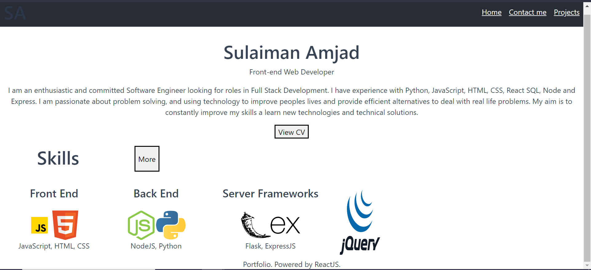

# React-Portfolio

# README-Generator
Trilogy Bootcamp Module 13 Challenge - README Generator

## Description 

This project is a portfolio page for myself, to display my work and skills to others.
The website displays:
- Home Page:
    - Bio
    - Skills
- Project:
    - 6 projects
    - Links to the repo and deployed project
    - Skills involved in that project
- Contact page:
    - Contact details
    - Contact form to reach me by email
- CV
    - pdf of my CV displayed

## Table of Contents

* [Installation](#installation)
* [Usage](#usage)
* [License](#license)

## Installation

N/A

## Usage 

https://sulaiman-ai.github.io/React-Porfolio/

## License

Please refer to the license in the repo.

## Contributing

If you wish the contribute to this project and add new features:
1. Send me an email explaining what you want to add (email written below) and I will add you as a contributor
2. Create an issue for any new feature you want to add
3. Create your own branch for your code
4. When you are ready to upload, start a pull request for me to review

## Questions

Information about me available in my portfolio linked above.